ifdef::env-github[]
:tip-caption: :bulb:
:note-caption: :information_source:
:important-caption: :heavy_exclamation_mark:
:caution-caption: :fire:
:warning-caption: :warning:
endif::[]

== Open Data Hub with Easybuild and Lmod, or thousands of libraries and applications without installation!

*TL;DR*: container images on a data science platform like link:http://opendatahub.io/[Open Data Hub] are hard to manage if you want to provide users with many different libraries or applications, moreover at various versions. +
This repo shows how you can use EasyBuild, Lmod and a shared PVC to bring thousands of those instantly in the notebook environments with a single container image!

=== Intro

==== The problem

If you manage shared data science environments based on Kubernetes, like link:http://opendatahub.io/[Open Data Hub] on link:https://www.redhat.com/en/technologies/cloud-computing/openshift[OpenShift], you may face a container image management problem. That is especially true with interactive environments like Jupyter-as-a-Service. Your users will want to use various Jupyter images that include this or this library or application, at this or this version. Of course it's clearly impossible to create behemoth images including each and every library you're asked for, or to create and manage hundreds (thousands?) of variations of handpicked selection of libraries and apps to fit a specific need.
Granted, you could let the users pip or conda install everything from scratch every time they launch the environment. But it's not that practical, and not all packages are available through this mean, especially your own private applications.

.Your options
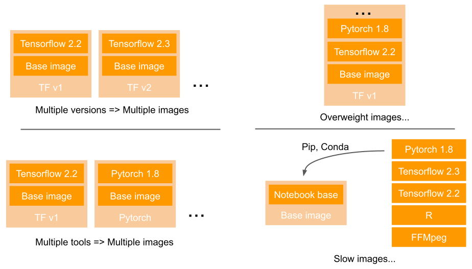
++++
 
++++

==== The solution

In this repo you will find tools and instructions for a different approach to this problem, thanks to the HPC community who has solved it a long time ago! This is kind of a portage of their solution to Kubernetes.

The idea is that instead of building the needed applications and libraries into the container images, you can store all of them in a read-only shared library on a ROX volume (read-only, but by many pods simultaneously), and mount this volume inside the Pods at spawn time. +
Then, leveraging Linux Environment Modules with link:https://lmod.readthedocs.io/en/latest/[Lmod], it gets easy to dynamically "load" what you need, when you need it, instantly... Pretty neat, uh?

.Dynamic loading
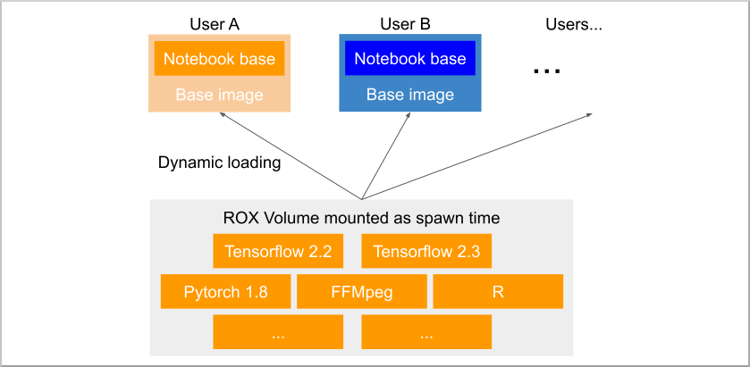
++++
 
++++

And with link:https://easybuild.io/[Easybuild], you have access to a few thousands of ready to use (or more accurately to compile, we'll come to that) software packages, plus the full machinery to easily create you owns.

==== What does it look like?

With the help of a great Jupyter extension to easily load those shared modules, it's really easy! Have a look:

.Dynamic loading
image::doc/img/jupyterlab_demo[Modules in JupyterLab]
++++
 
++++

=== Demo environment installation

Here are the instructions to create and populate a shared libray with common modules and applications (PyTorch, Tensorflow, R, RStudio, VS Code,...).

==== Prerequisites

* A deployment of Open Data Hub in your OpenShift cluster. Only the JupyterHub part is necessary to show the usage of the shared library with notebooks.
* Open Data Hub is deployed into the `opendatahub` namespace, and Jupyter Notebooks are created in this same namespace. If your configuration is different you will have to adapt the configuration files and deployment instructions.
* The ability to create RWX (Read-Write Many) PVCs. In this deployment, we use the `ocs-storagecluster-cephfs` storage class provided by OpenShift Data Foundation.

==== Deployment

.Switch to the right project
[source,bash]
----
oc project opendatahub
----

.Create the PVC that will host the library
[source,bash]
----
oc apply -f deploy/01_easybuild-data_pvc.yaml
----

.Initialize the PVC with data
[source,bash]
----
oc apply -f deploy/02_easybuild-data-init_job.yaml
----

NOTE: This part can take some time as the package is about 15GB. It has to be downloaded then injected into the PVC.

.Create the ImageStream for the module-enabled notebook image
[source,bash]
----
oc apply -f deploy/03_s2i-generic-datascience-lmod-notebook_imagestream.yaml
----

.Create the ConfigMap to enable the notebook image in JupyterHub
[source,bash]
----
oc apply -f deploy/04_jupyter-lmod-profile_configmap.yaml
----

**Optional**

This step is only if you want to spawn an easybuild environment to build other modules or create your own ones.

.Deploy the EasyBuild container
[source,bash]
----
oc apply -f deploy/05_easybuild_deployment.yaml
----

=== Usage

==== Using the "Modular" notebook image

From you JupyterHub spawner, you now have a new notebook image available, `Standard Data Science - Modular`.

.JupyterHub Launcher
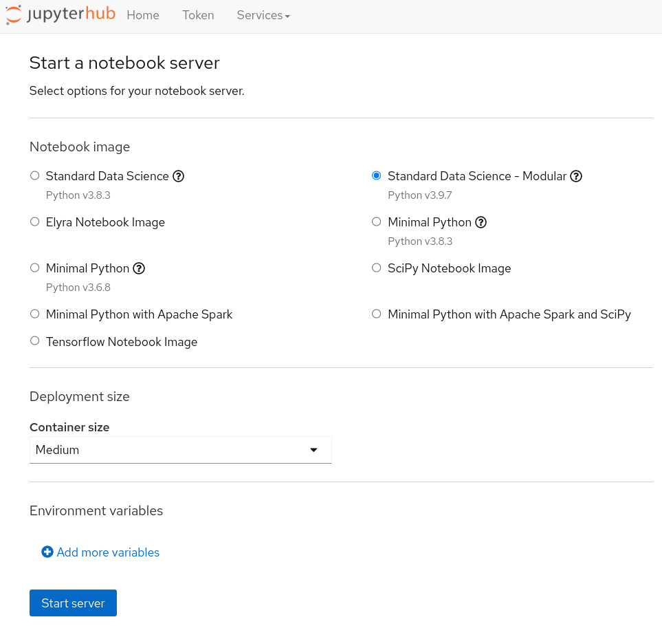
++++
 
++++

In this JupyterLab instance you have access to a new extension, "Softwares". Here are basic instructions on how to use it.

The list of available modules is splitted in two sections. The "featured" modules, and the full list:

.Module list
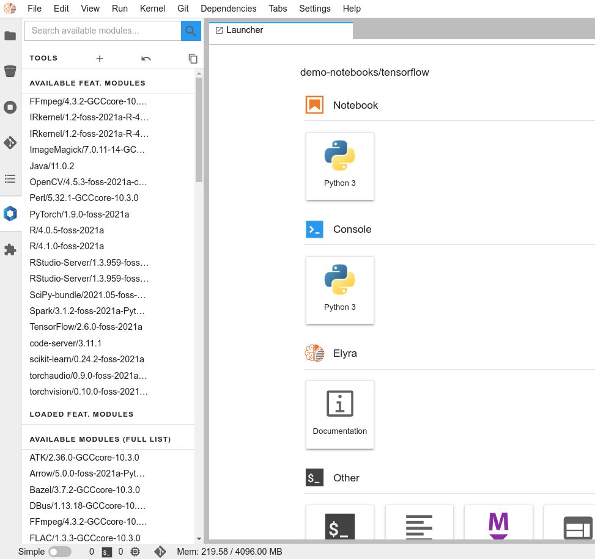
++++
 
++++

You can use the filter box to search for a specific module (just enter a few letters). Filtering happens simultaneously on both lists:

.Filtered list
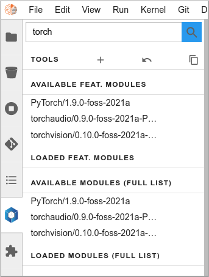
++++
 
++++

If you click on a module name, a pop-up will give you more information: description, dependencies,...

.Module info
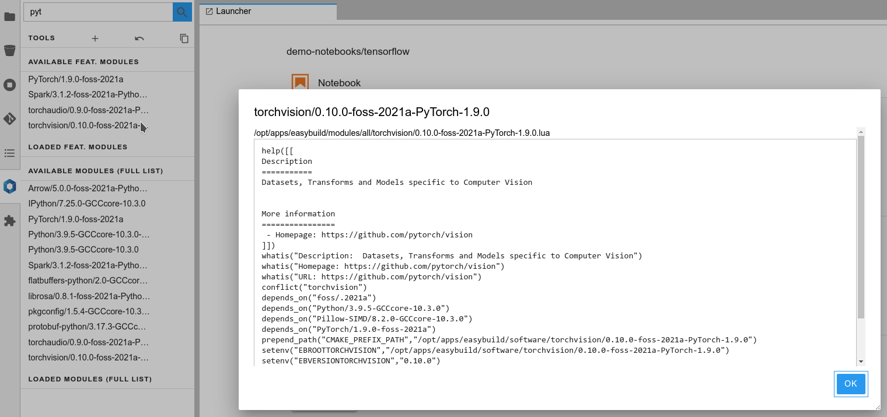
++++
 
++++

To load a module, hover on it and click on the "Load" button:

.Module loading
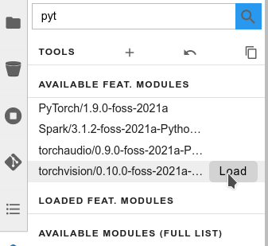
++++
 
++++

The module and all its dependencies is automatically loaded (torchvision in this example):

.Module loaded
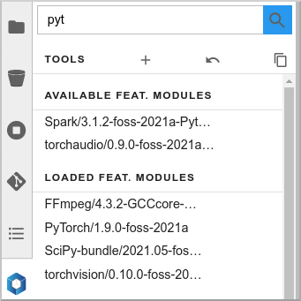
++++
 
++++

To unload a module, hover it the "loaded" list, and click "Unload":

.Unload Module
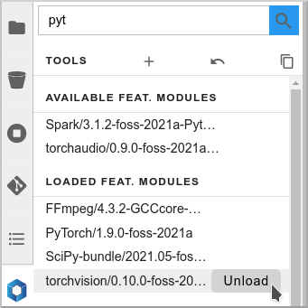
++++
 
++++

The module and its dependencies will be automatically unloaded.

NOTE: Lmod keeps track of the loaded dependencies for each module. If two different modules share dependencies, a module unloading won't affect the other one, its dependencies will still be there. There are only unloaded when no module needs them anymore!

==== Advanced functions

===== Collections

If you want to create a specific environment with a set of different modules that you want to use, no need to recreate this from scracth every time! You can simply load those modules, then create a "Collection". Next time, just restore this collection in two clicks.

To create a collection, load the modules you want, click on the icon and give a name to the collection.

.Create Collection
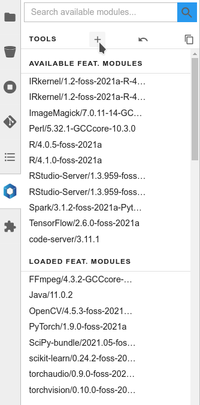
++++
 
++++

.Name and Save Collection
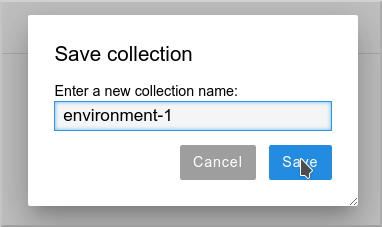
++++
 
++++

When you want to bring back this environment, just click on the Restore icon, and select and load your collection.

.Restore Collection
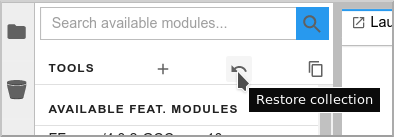
++++
 
++++

.Restore Collection
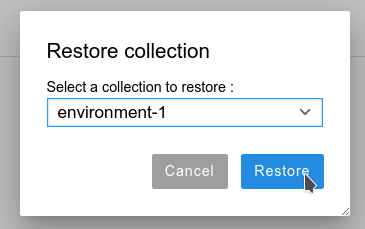
++++
 
++++

===== Imports

You can also directly work from your notebooks and your scripts to load the modules that you need. To know which modules you have to use, you can directly export the relevant Python code!

Click on the "Generate Python code" icon:

.Generate Code
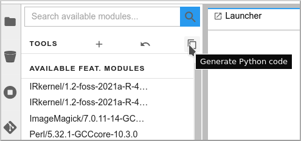

++++
 
++++

You can then copy paste the full code in you first notebook cell or in your script:

.Python Code
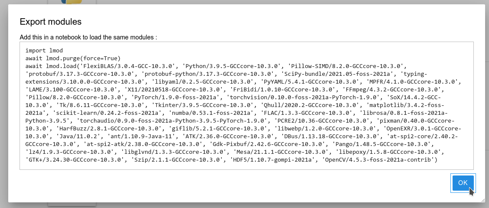

++++
 
++++

[NOTE]
====
Of course, for this to work in your notebook or your script, the container image or environment you are using must be "lmod-enabled", and the library with the relevant modules must be accessible/mounted into this environment.
====

